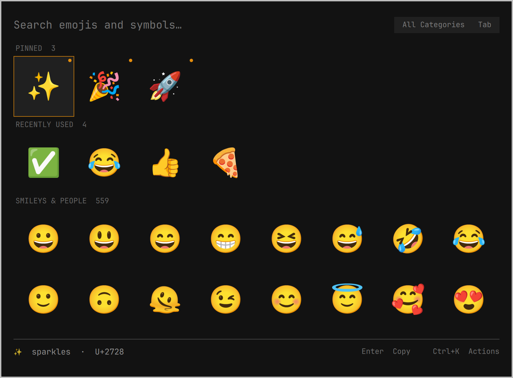

# Emoji Picker

A Raycast-style emoji and symbol picker for the Omarchy shell. Search the
full Unicode emoji set plus the text symbol blocks, pin what you use, and
insert with a keystroke.



## What it does

| | |
|---|---|
| Search | Names, CLDR keywords and your own keywords, all at once |
| Ranking | Pinned first, then how often and how recently you used it, then match quality |
| Typo fallback | When nothing matches, a subsequence pass finds `grnning` -> grinning face |
| Browse | Pinned and Recently Used above the eight Unicode categories |
| Categories | Tab cycles the filter, or pick one from the action panel |
| Skin tones | A default tone in preferences, and a per-insert tone submenu with previews |
| Pinning | Pinned emoji stay at the top of the grid, marked with an accent dot |
| Custom keywords | Assign your own words to any emoji or symbol |
| Text symbols | 2,282 arrows, math operators, currency signs, punctuation and Greek letters |
| Actions | Paste, copy, paste and keep open, copy the codepoint, pin, assign keywords |
| Preferences | Primary action, default skin tone, 6 to 10 grid columns, recent rows |

## Install

```sh
omarchy plugin add https://github.com/jesse-chelin/omarchy-emoji-picker --enable
```

Then bind a key. Omarchy ships `SUPER + CTRL + E` pointed at its built-in
picker, so either replace that binding or add your own in
`~/.config/omarchy/bindings.lua`:

```lua
o.bind("SUPER + PERIOD", "Emoji Picker", "omarchy-shell shell toggle io.github.jesse-chelin.emoji-picker")
```

## Keys

| Key | Action |
|---|---|
| Type | Search |
| Backspace, Ctrl+Backspace, Ctrl+U | Delete a character, a word, the lot |
| Arrows, Page Up/Down, Home, End | Move the cursor |
| Enter | Primary action, paste by default |
| Ctrl+Enter | The other one, copy by default |
| Ctrl+Shift+Enter | Paste and keep the picker open |
| Ctrl+Alt+Shift+C | Copy the codepoint, for example `U+1F600` |
| Ctrl+. | Pin or unpin |
| Ctrl+T | Skin tone submenu for this insert |
| Ctrl+E | Assign custom keywords |
| Tab, Shift+Tab | Cycle the category filter |
| Ctrl+K | Action panel |
| Ctrl+, | Preferences |
| Esc | Clear the category, then the search, then close |

## Pasting needs wtype

Inserting into the focused window is a synthesised `Shift+Insert`, which
needs `wtype`:

```sh
sudo pacman -S wtype
```

Ctrl+K offers to install it, which hands off to `omarchy install app` and runs
the install in a floating terminal where you can answer the password prompt.
Without wtype the picker still works and Enter copies instead, and it says so
in the footer rather than firing a paste that goes nowhere. The paste path holds
the clipboard only while the keystroke lands, so whatever you had copied
before is still there afterwards.

## State

Pins, usage counts, custom keywords and preferences live in
`~/.local/state/omarchy/emoji-picker.json`. Delete it to start over.

## Regenerating the emoji data

`emoji-data.json` is generated from Unicode and CLDR at build time, so the
plugin never touches the network:

```sh
./tools/build-data.py
```

It filters against the installed Noto Color Emoji, because an emoji whose
glyph the font lacks renders as a hollow box. Rerun it after a Unicode
release or a font update.

## Development

```sh
./check.sh
```

Runs the manifest validation, `qmllint`, the QML unit tests, the structural
scans that `qmllint` misses, the data invariants and the glyph check. It is
the same command CI runs.

The picker exposes its whole state machine over IPC, because keyboard focus
inside a layer-shell surface cannot be synthesised from outside:

```sh
id=io.github.jesse-chelin.emoji-picker
omarchy-shell shell call $id stateJson ""
omarchy-shell shell call $id setQuery "pizza"
omarchy-shell shell call $id moveBy "1,0"
omarchy-shell shell call $id menuOpen actions
```

Overlays are held by a `Loader` keyed on the source URL, so edits to the QML
need `omarchy-restart-shell` to take effect.

## License

MIT
